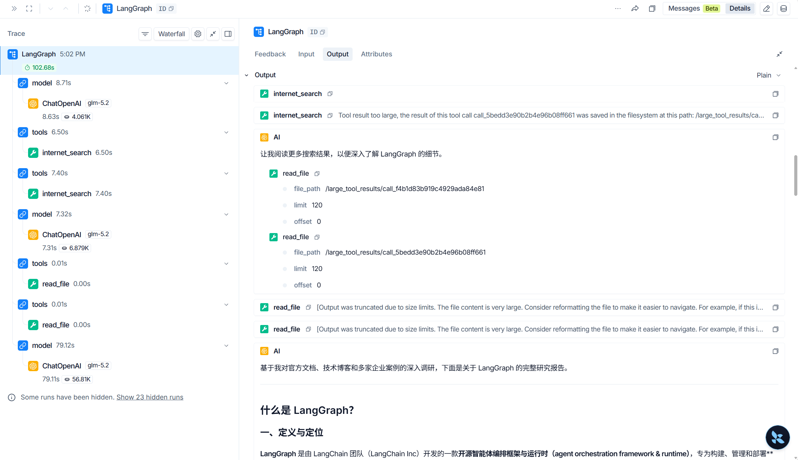

 # CH 01-02


## 第一章

**Agent 开发的三个层次：**

| 层次             | 类比               | 代表       | 核心价值                                   |
| ---------------- | ------------------ | ---------- | ------------------------------------------ |
| Runtime 运行时层 | 工作台，电源，护具 | LangGraph  | 持久化、流式、人机协作、状态管理           |
| Framework 框架层 | 锤子，锯子，钉子   | LangChain  | 模型抽象、工具接口、Agent 循环、中间件     |
| Harness 工具层   | 开箱即用的工具间   | DeepAgents | 预置文件系统、任务规划、子 Agent、长期记忆 |

**Deep Agents所解决的问题：**

>  如果通过LangChain搭建Agent，需要手写文件处理、手写工具、手写任务追踪逻辑等功能，而这些功能是大	部分Agent都必须具有的，因此需要将这些模式固化下来，不需要每次都从头实现。

**Deep Agents的能力**

> 文件处理、命令控制、文件检索、写工具、子智能体等

​	**核心设计理念：Context Engineering**（上下文工程）引入虚拟文件系统，让 Agent 像人一样工作，通过调用 `read_file` / `write_file` / `grep`等工具，只将真正需要的信息保存在上下文里。此方法避免了传统模式下把所有信息都塞入prompt里导致的上下文窗口溢出、注意力稀释、不可扩展等致命问题。

---


**竞品对比**

| 产品             | 优势                                                         |
| ---------------- | ------------------------------------------------------------ |
| Deep Agents      | 模型无关性，长期记忆，虚拟文件系统，可插拔后端， Sandbox-as-Tool 模式，LangSmith可观测性 |
| Claude Agent SDK | Claude模型深度集成，Hooks 系统，自定义 HTTP/WebSocket 层和容器化部署 |
| Codex SDK        | OS级别的沙箱模式，MCP Server模式，云端执行环境               |

## 第二章

**最简单的 Deep Agent**

> 我使用的是阿里云百炼平台的glm-5.2模型，同样兼容OpenAI接口。api_key等配置在.env文件内

```python
import os
from langchain_openai import ChatOpenAI
from deepagents import create_deep_agent
from dotenv import load_dotenv

load_dotenv()

model = ChatOpenAI(
    model=os.environ.get("MODEL_NAME", "glm-5.2"),
    api_key=os.environ.get("DEEPAGENTS_API_KEY"),
    base_url=os.environ.get("DEEPAGENTS_API_BASE"),
)


def get_weather(city: str) -> str:
    """Get weather for a given city.""" #实际写案例时docstring遗漏，导致运行报错
    return f"It's always sunny in {city}"


agent = create_deep_agent(
    model=model,
    tools=[get_weather],
    system_prompt="You are a helpful assistant.")

result = agent.invoke(
    {"messages": [{"role": "user", "content": "北京今天天气怎么样？"}]})
print(result["messages"][-1].content)

```

>  此案例通过调用固定函数`get_weather`来获取信息，通过这个小案例延展了自定义工具的三要素：参数类型标注，Docstring，默认值，这三要素缺一不可。

---

**构建一个研究助手**本案例介绍通过调用真实搜索API（Tavily）





## 总结

- **ch01**：初步理解Agent开发的三个层次 `Runtime->Framework->Harness`，Deep Agents 的核心设计理念引入虚拟文件系统，与其他竞品相比Deep Agents 的优势
- **ch02**: 通过简单的命令行完成环境部署，学习到了框架基本使用方法。